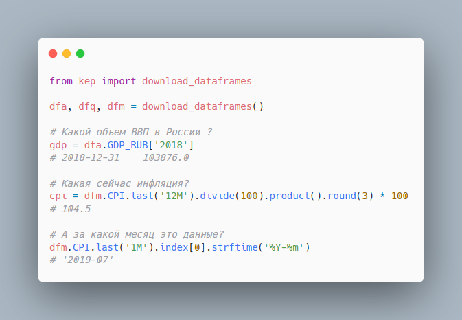

# kep-xls

Get Rosstat macroeconomic time series.

Rosstat publishes some macroeconomic time series as Excel files since 2019 ([source](https://www.gks.ru/compendium/document/50802)). 
With kep you can either build this data from downloaded Excel file or get clean timeseries directly from stable URLs.


### Usage 

```python 
from kep import download_dataframes

dfa, dfq, dfm = download_dataframes()

# Какой объем ВВП в России?
gdp = dfa.GDP_RUB['2018']
# 2018-12-31    103876.0

# Какая сейчас инфляция?
cpi = dfm.CPI.last('12M').divide(100).product().round(3) * 100
# 104.5

# А за какой месяц это данные?
dfm.CPI.last('1M').index[0].strftime('%Y-%m')
# '2019-07'
```



### Download clean data

With `kep.download_dataframes()` you can download the data from stable URLs.

```python 
from kep import download_dataframes

dfa, dfq, dfm = download_dataframes()
```


### Build dataset locally

`kep_build.py` saves timeseries as local CSV files importable by pandas or R. 

```
pip install -r requirements.txt
python kep-build.py
```

### Variables

10 variables currently produced: 
`COMM_FREIGHT`, `CPI`, `GDP_INDEX`, `GDP_RUB`, `GOV_EXP_CONS_ACCUM`, 
`GOV_INC_CONS_ACCUM`, `INVEST_INDEX`, `INVEST_RUB`, `RETAIL_SALES`, `WAGE`.

### Still want an Excel file?

We have it [here](https://github.com/mini-kep/kep-xls/blob/master/output/df.xlsx?raw=true).

